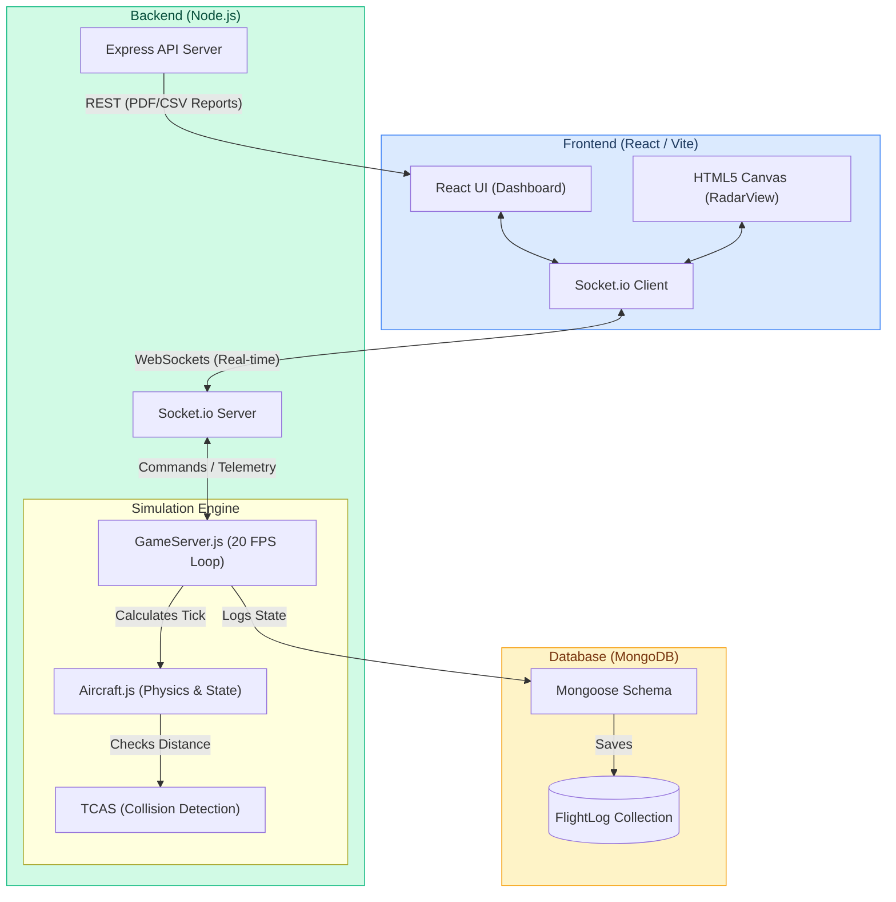

# ✈️ ATC Simulator - Master Control Node
A highly realistic, real-time Air Traffic Control (ATC) simulation engine powered by the MERN stack and WebSockets.

## 🚀 Overview
The ATC Simulator is a centralized command dashboard that allows users to seamlessly manage airspace traffic. It serves a dual purpose:

1. Providing a premium, dynamic HTML5 Canvas radar dashboard to monitor aircraft physics in real-time.
2. Hosting a robust Node.js physics engine that calculates aircraft movement, handles collision detection, and logs telemetry to a persistent database.

Built with **React (Vite)**, **Node.js**, **Express**, **MongoDB Atlas**, and **Socket.io**.

## 🌐 Live Links
💻 **Web Dashboard:** https://atc-simulator-five.vercel.app/

---

## 🏗️ System Architecture



---

## 🌟 Core Features & Physics Engine

### 1. ⚙️ Real-Time 20-FPS Physics Engine
The backend operates a highly sophisticated simulation loop independently of the clients:
- Computes aircraft movement using pure trigonometry (`Math.cos`, `Math.sin`) on a mathematical coordinate plane.
- Maintains a complex 7-stage state machine for every aircraft (Parked, Taxiing, Takeoff, Airborne, Landing, Finished, Crashed).
- Implements fuel-starvation mechanics, global out-of-bounds garbage collection, and mathematically perfect glide-slopes.

### 2. 🚨 Automated TCAS (Collision Detection)
The Node.js engine continuously scans the airspace using the Pythagorean theorem to detect airspace violations:
- **TA (Traffic Advisory):** Warns the controller when aircraft violate minimum separation (Yellow Warning).
- **RA (Resolution Advisory):** Triggers a critical red alert when an imminent mid-air collision is detected.

### 3. 🎨 Ultra-Premium Canvas Radar UX
The React frontend bypasses standard DOM rendering for the radar:
- Renders the radar sweeping UI and aircraft vectors entirely on a native HTML5 `<canvas>` using `requestAnimationFrame`.
- Features phosphor-trail breadcrumbs, dynamic 3D altitude scaling, and speed-trend predictive vectors.
- Styled heavily with Tailwind CSS glassmorphism elements.

### 4. 📊 Automated Corporate Reporting
Generates mathematically precise flight logs and exports them beautifully:
- **PDF Export:** Uses `pdfkit` to draw and stream a fully styled, zebra-striped, corporate aviation report instantly on the fly.
- **CSV Export:** ISO-8601 formatted CSV sheets engineered specifically for Excel data-analysis compatibility.

---

## 🛠️ Local Setup & Testing

### Prerequisites
- Node.js (18+)
- MongoDB Atlas account (Free Tier)

### 1. Environment Setup
Clone the repository:
```bash
git clone https://github.com/Harshkumar2306/ATC-Simulator-.git
cd ATC-Simulator-
```

#### Backend Setup
```bash
cd server
npm install
```
Create a `.env` file in the `/server` directory:
```env
MONGO_URI=mongodb+srv://<username>:<password>@cluster.mongodb.net/atc_simulator
ADMIN_PASSWORD=admin123
PORT=3001
```

#### Frontend Setup
```bash
cd ../client
npm install
```

### 2. Run the Development Servers
Open two terminal windows:

**Terminal 1 (Backend Engine):**
```bash
cd server
npm run start
```

**Terminal 2 (Frontend React UI):**
```bash
cd client
npm run dev
```
Navigate to `http://localhost:5173` to view the ATC Dashboard!

---

## ☁️ Cloud Deployment (Vercel / Render)
This application utilizes separate deployments for the frontend UI and the persistent Node.js backend.
1. Deploy the `client/` folder to **Vercel** as a Vite project.
2. Deploy the `server/` folder to **Render** as a persistent Node web service (since WebSockets require a persistent long-polling server).
3. Ensure the Frontend points to the Render backend URL in `socket.io`.

---

## 📁 Project Structure
```text
ATC-Simulator/
├── client/                 # React Frontend
│   ├── src/
│   │   ├── components/     # UI Blocks (RadarView, FlightList, CommsLog)
│   │   ├── App.jsx         # Main React Component
│   │   └── main.jsx        # React DOM Entry
│   ├── index.html          # HTML Template
│   └── package.json        # Frontend Dependencies
│
└── server/                 # Node.js Backend
    ├── game/
    │   ├── GameServer.js   # Master simulation loop and state manager
    │   └── Aircraft.js     # Physics, movement, and individual aircraft logic
    ├── db.js               # MongoDB connection and Mongoose schemas
    ├── index.js            # Express server, Socket.io init, and Export Routes
    └── package.json        # Backend Dependencies
```

---

## 🧪 Core API Endpoints & Sockets

| Method | Endpoint / Event | Description |
|--------|----------------|-------------|
| `GET` | `/export/pdf` | Streams a mathematically precise, fully styled PDF aviation report on the fly. |
| `GET` | `/export` | Streams an ISO-8601 compatible CSV data sheet for Excel analytics. |
| `SOCKET` | `gameState` | Broadcasts the real-time simulation tick array to all clients at 20 FPS. |
| `SOCKET` | `command` | Accepts encrypted controller directives (Takeoff, Land, Hold, etc) to alter aircraft physics. |

> *The uncompromising backbone of digital airspace management.*
